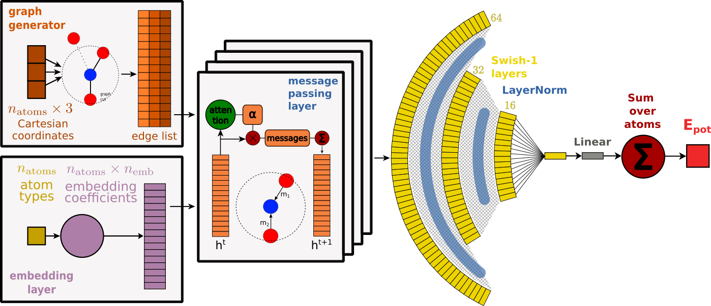
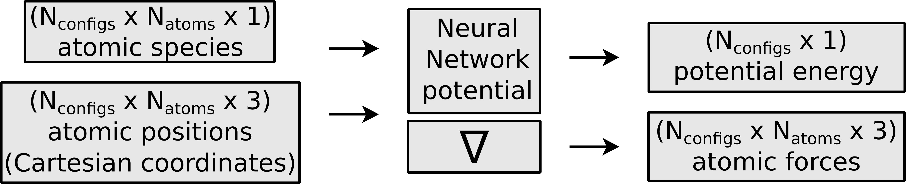
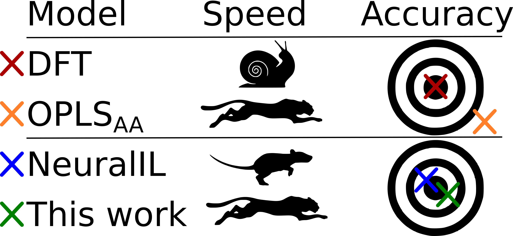
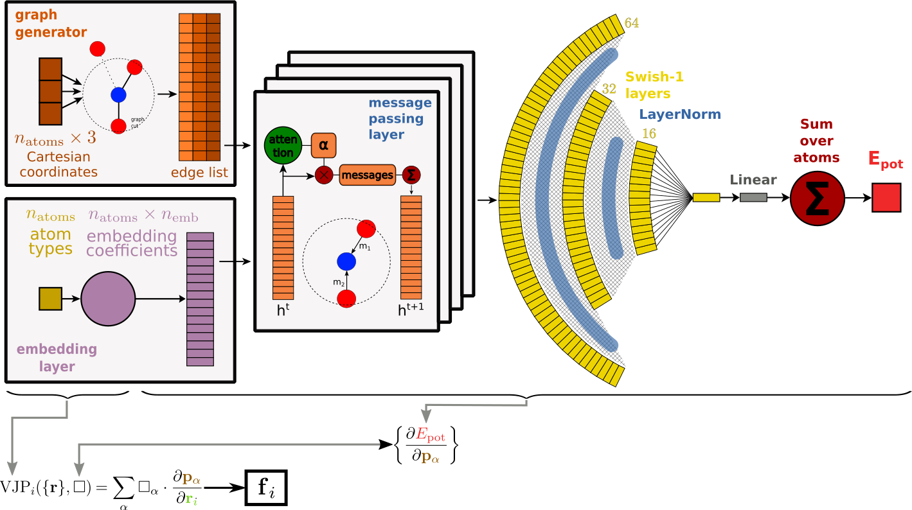
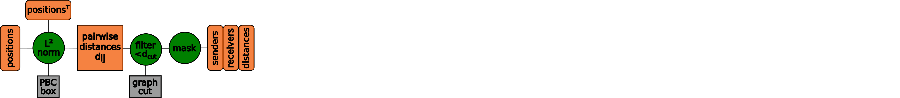
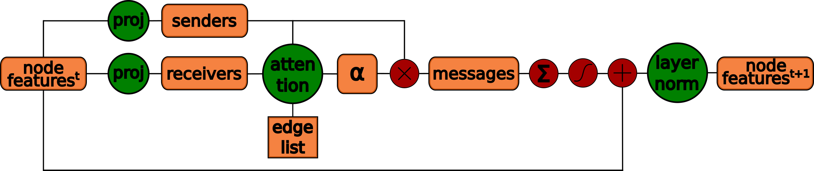
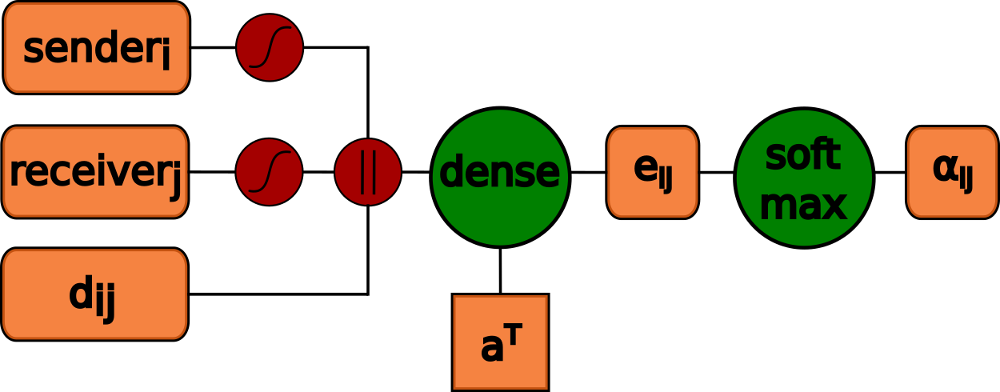

# Sparse graph attention networks as efficient ionic liquid potentials
Master thesis: Jraph Attention neTworks (JAT), a deep learning architecture to predict the potential energy and forces of organic molecules and ionic liquids.

- to predict the potential energy and atomic forces of molecules
- operates within the message passing neural networks (MPNN) framework [2]
- extends the NeuralIL [1] architecture and implementation
- adapts Graph Attention Networks (GAT) to replace fingerprint features

The JAT architecture takes as input the 3N Cartesian coordinates and N types (atomic species) for a molecule with N atoms. With these, the model

- generates a sparse molecular graph
- iteratively refines the type embeddings h^0 with multiple message passing layers
- using the dynamic linear attention function (GATv2) [4] as the message function

    (masked multi-headed self-attention),
- and a weighted sum of features and skip connection as the update function,
- a pyramidal regression head as the readout function
- and finally takes a sum over all atomic contributions to obtain the potential energy. 

<p align="center">

</p>


# Architecture overview & background
The architecture uses message passing neural networks (MPNN) [2] with an attentional update function (linear dynamic attention, GATv2) [4] by adapting Graph Attention Networks (GAT) [3] to the domain of computational chemistry. The name JAT (JraphAttentionNetworks) derives from adapting Graph Attention Networks in JAX and builds upon the Jraph library. 

The JAT code and architecture was developed during the master's thesis at TU Vienna with the department of Theoretical Materials Chemistry under supervision of Dr. Jesús Carrete Montaña. The NeuralIL [1] implementation serves as a baseline implementation and reuses code to train the model.

In this thesis, I've

- built a deep learning architecture by adapting a state-of-the-art DL approach (Graph Attention Networks) to the domain of computational chemistry
- adapted the NeuralIL codebase (which uses conventional and computationally expensive fingerprint features and a shallow neural network)
- performed an extensive literature review surveying the state-of-the-art in multiple fields (computational chemistry, graph-based/geometric deep learning, attention & Transformer-based architectures) to extract the most promising approaches
- optimized, debugged and trained the architecture on a small dataset of ionic liquids
- scaled the architecture to the very large ANI-1 dataset
- while optimizing for efficiency of the architecture and achieving a 4x speedup over the supervisors' baseline with comparable accuracy.

# Overview
[Also available as a poster here!](https://github.com/stefanhoedl/JAT_potential/blob/main/figs/JAT_thesis_poster.pdf)

## Problem context: What's a potential?

- Domain:        Computational chemistry
- Goal:           Predict the energy of molecules
- Task:           Learn the potential energy surface (PES)
	- atomic positions → energy mapping
	- high-dimensional task (3N - 6 degrees of freedom for N atoms)
- Problem:     "Exponential barrier" of electronic contribution 
- Solution:        Approximate the Schrödinger Equation efficient Deep Neural Networks


<p align="center">

</p>

___

## … but why? Molecular Dynamics!
- Obtain 3Natoms forces as gradient of energy w.r.t. positions
- Use atomic forces to integrate Newton's equations of motion
- requires very small timestep Δt ~ fs, (10^-15 s)
- 1M+ steps to watch something interesting happen...
- thus 1M+ model evaluations, making efficiency crucial
- model & its gradient for value (energy) and grad (forces)
<p align="center">

</p>

___
## Approach
- Adapt NeuralIL implementation [1]
- replace spherical Bessel descriptors with a Message Passing Neural Network [2]
- using Graph Attention Networks [3]
- on a sparse molecular graph

## Going fast
- replace computationally expensive descriptors
- implemented in JAX leveraging a GPU
- just-in-time (JIT) compilation
- sparse graph for sparse self-attention 
  O( N^2 ) → O( N * max(Nneighbours) ) for fully connected graph
- mask for edges & atoms for JIT static shape 

## Features
- invariant to rotation, translation and permutation
- additive ansatz: sum of atomic contributions
- trains on energy or forces
- locality for MD parallelization
- smooth nonlinearity (Swish-1) and loss function (log-cosh)

___
# JAT architecture
## [JatCore](https://github.com/stefanhoedl/JAT_potential/blob/main/src/jat/jat_model.py#L17) and [JatModel](https://github.com/stefanhoedl/JAT_potential/blob/main/src/jat/jat_model.py#L319)

```
src > jat_model.py > JatCore
src > jat_model.py > JatModel
```
<p align="center">

</p>

Visualization of the entire JAT architecture. Using the positions and species (types) as input, the graph generator generates a sparse edge list, with which T message passing steps (here 4) using an attentional update function are performed. The features $h^0$ at $t=0$ are obtained from the type embedding layer, for $t=1 - T$ the output features of the last message passing steps serve as input for the next JAT layer. 

The readout head transform the features $h^T$ using projection, nonlinearity and normalization layers into the energy contribution for each individual atom. The JAT model's prediction for the potential energy $E_{pot}$ is obtained as the sum over all atoms' contributions, while the forces $\textbf{f}$ are obtained as the model's derivative with respect to the atomic positions.

JatModel is a Wrapper around the JatCore model to calculate the potential energy (`model.calc_potential_energy`) or atomic forces (`model.calc_forces`).

## [Graph Generator](https://github.com/stefanhoedl/JAT_potential/blob/main/src/jat/jat_model.py#L231)
```
src > jat_model.py > GraphGenerator > make_graph
```

<p align="center">

</p>

Visualization of the graph generator component of the JAT architecture. Using the Cartesian coordinates (positions) of all atoms, the pairwise distance matrix is calculated using the Euclidean $\textrm{L}^2$ norm under consideration of periodic boundary conditions. The distances are filtered using the graph cut parameter to only include pairs within close proximity, which are connected by an edge. This generated molecular graph is represented as an *edge list* in a sparse format using three arrays, respectively the triplets of sender, receiver and distance. Since the number of edges depends on the positions, the edge list is padded with masked edges up to a static maximum.

## [JAT Layer](https://github.com/stefanhoedl/JAT_potential/blob/main/src/jat/jat_model.py#L97)
```
src > jat_model.py > JatLayer
```
<p align="center">

</p>

Visualization of a single JAT layer, which performs a single round of message passing to update the node feature vectors. The features $h^{t}$ at step $t$ are projected into senders and receivers, and for every pair in the edge list a weight $\alpha$ is calculated using the attention mechanism. The messages are calculated as the element-wise multiplication of the sender features and attention weights $\alpha$. These messages are aggregated to each receiver using a segment sum and transformed with a nonlinearity, skip connection and layer normalization to obtain the updated node features $h^{t+1}$. These are fed into the next JAT layer to repeat the message passing procedure for multiple rounds.

## [Linear dynamic attention](https://github.com/stefanhoedl/JAT_potential/blob/main/src/jat/jat_model.py#L126)
```
src > jat_model.py > JatLayer.attention()
```
<p align="center">

</p>
Visualization of the attention mechanism of the JAT architecture. For every $\mathrm{edge}_{ij}$ in the edge list, the features of $\mathrm{sender}_{i}$, $\mathrm{receiver}_{j}$ and $d_{ij}$ are *lifted* and with a projection parametrized by $a^T$ transformed into $e_{ij}$. These weights are normalized over all received messages with a segment softmax function to obtain $\alpha_{ij}$. }
___

# Setup
Clone the repository, create an environment using conda and install dependencies using pip.

```
git clone https://github.com/stefanhoedl/JAT_potential
cd JAT_potential
conda create -e JAT
conda activate JAT
pip install .
```
After successful installation, run scripts with `python3 ean/train_JAT_EAN.py`.

If you have a GPU, install a matching CUDA-supported jaxlib version: 

[Download jaxlib 0.3.10+cuda11.cudnn805 here](https://storage.googleapis.com/jax-releases/cuda11/jaxlib-0.3.10+cuda11.cudnn805-cp38-none-manylinux2014_x86_64.whl) to match installed jax, cuda & cudnn versions

# EAN dataset
```
ean > train_JAT_EAN.py     - minimal training script, val only
ean > full_JAT_training.py - full script with val+test, logging, loading
ean > load_run_JAT_EAN.py  - script to load trained model & predict

ean > configurations.json  - EAN dataset
ean > models > 
    JAT_EAN15_ep3K.pickle  - Model weights after 3K training epochs
```
[Script to train JAT on EAN dataset](https://github.com/stefanhoedl/JAT_potential/blob/main/ean/train_JAT_EAN.py)

- Ionic liquid: anion-cation pairs (salt) in liquid phase at room temperature
- 15 EAN pairs → 225 atoms
- Copyrights for EAN dataset from NeuralIL authors
- sampled from OPLS-AA MD trajectory
- Reference energy & forces from DFT
- 741 configurations
- training on atomic forces

# ANI-1 dataset
[Download ANI-1 dataset here](https://github.com/isayev/ANI1_dataset) and unzip to data directory

```
ani1 > train_JAT_ANI1.py   - full ANI-1 training script
ani1 > ANI-1_release       - ANI-1 data directory
       > ani_gdb_s01.h5    - Data files, 1-heavy atom subset

```
[Script to train JAT on ANI-1 dataset](https://github.com/stefanhoedl/JAT_potential/blob/main/ani1/train_JAT_ANI1.py) 


# References
[1] Hadrián Montes-Campos, Jesús Carrete, Sebastian Bichelmaier, Luis M Varela, and Georg KH Madsen. A differentiable neural-network force field for ionic liquids. Journal of chemical information and modeling, 62(1):88–101, 2021

[2] Justin Gilmer, Samuel S Schoenholz, Patrick F Riley, Oriol Vinyals, and George E Dahl. Neural message passing for quantum chemistry. In International conference on machine learning, pages 1263–1272. PMLR, 2017. 

[3] Petar Velickovic, Guillem Cucurull, Arantxa Casanova, Adriana Romero, Pietro Lio, and Yoshua Bengio. Graph attention networks. stat, 1050:20, 2017.

[4] Brody, Shaked, Uri Alon, and Eran Yahav. "How attentive are graph attention networks?." arXiv preprint arXiv:2105.14491 (2021).

# Citation
If you find this code useful, please cite the following:

```
@misc{Hödl2022JAT,
  author = {Hödl, Stefan},
  title = {Sparse graph attention networks as efficient ionic liquid potentials},
  year = {2022},
  publisher = {Technical University Vienna},
  journal = {GitHub repository},
  howpublished = {\url{https://github.com/stefanhoedl/JAT_potential}},
}
```

# Useful links
[NeuralIL code](https://github.com/Madsen-s-research-group/neuralil-public-releases) and [Paper](https://pubs.acs.org/doi/10.1021/acs.jcim.1c01380)

[GATv2 LabML implementation](https://nn.labml.ai/graphs/gatv2/)

[GAT implementations in PyTorch](https://github.com/gordicaleksa/pytorch-GAT)

[JAX Docs](https://jax.readthedocs.io/en/latest/)

[Jraph Docs](https://jraph.readthedocs.io/)
