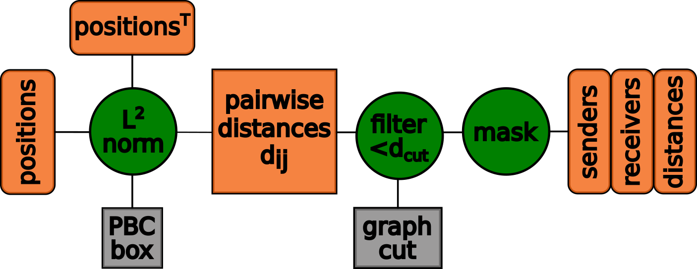
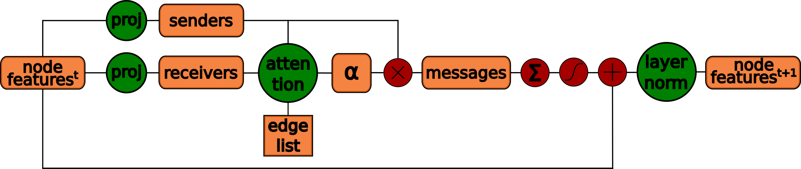

# JAT_potential
JAT (JraphAttentionNetworks), a deep learning architecture to predict the potential energy and forces of organic molecules and ionic liquids. 
The architecture uses message passing neural networks with an attentional update function (linear dynamic attention, GATv2) by adapting Graph Attention Networks (GAT) to the domain of computational chemistry.

The code for the JAT model was developed during the master's thesis at TU Vienna with the department of Theoretical Materials Chemistry under supervision of Dr. Jesús Carrete Montaña. 

In this thesis, I've
- built a deep learning architecture by adapting a state-of-the-art DL approach (Graph Attention Networks) to the domain of computational chemistry
- adapted the NeuralIL codebase (which uses conventional and computationally expensive fingerprint features and a shallow neural network)
- performed an extensive literature review surveying the state-of-the-art in multiple fields (computational chemistry, graph-based/geometric deep learning, attention & Transformer-based architectures) to extract the most promising approaches
- optimized, debugged and trained the architecture on a small dataset of ionic liquids
- scaled the architecture to the very large ANI-1 dataset
- while optimizing for efficiency of the architecture and achieving a 4x speedup over the supervisors' baseline with comparable accuracy.

JAT potential: Jraph Attention Network
to predict the potential energy and atomic forces of molecules

Extends the NeuralIL architecture and implementation
adapts Graph Attention Networks (GAT) to replace fingerprint features
within the message passing neural networks (MPNN) framework

performs multiple message passing steps by
- generating a sparse molecular graph
- using dynamic linear attention (GATv2) as the message function
    (masked multi-head self-attention)
- weighted sum of features + skip connection as the update function
- pyramidal regression head as readout function

